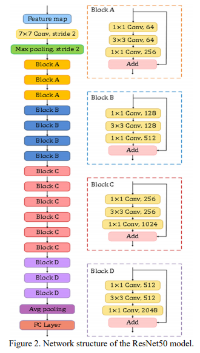
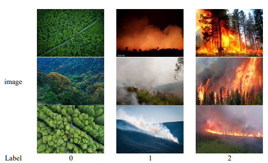
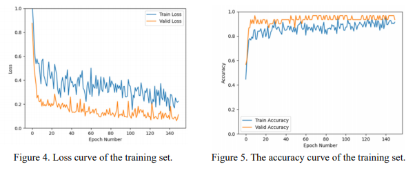

### FireClassification
A Deep Learning Algorithm for Forest Image
Classification
##### 1) Method
The code used the 50-layer Residual Network (ResNet50) as the feature extraction part of the forest
image classification algorithm. 

##### 2) Dataset
Since the forest fire data set has no public data set, the experiment obtained 175 forest images from the
Internet as the experimental data set(150 training images, 25 test images). Among the 150 images in
the forest image training set, there are 50 normal images, 50 smoke images, and 50 fire images, and
their labels are set to 0, 1, and 2, respectively.

##### 3) Experiment Result
the overall accuracy reached 92%

##### 4) Implementation details
**step 1**-> Download the pre-training model **resnet50-19c8e357**, and put it in the pretraing directory

Link：https://pan.baidu.com/s/164mSo-81ixu444tw0WXvRg

password：**8j7o**

**step 2** -> python train.py

**step 3** -> python test.py